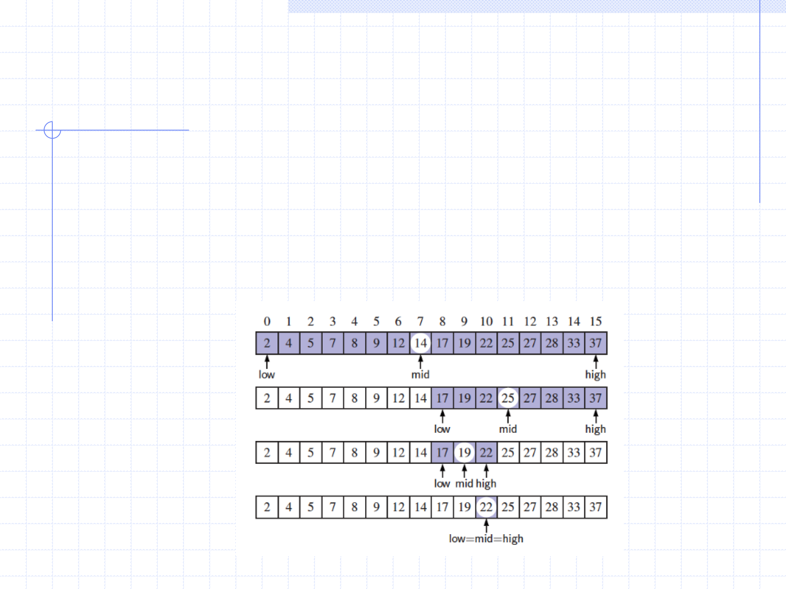

# Recursion

## Visualizing Binary Search

## Analyzing Binary Search

Runs in O(log n) time.

- In the worst case scenario, low = 0, high = n-1
- At each step, divide the search region by 2
- Let k be the number of steps or levels:
- mid = (low+high)/2 = (n-1)/2𝟏
- mid = (n-1)/2𝟐
- mid = (n-1)/2𝟑
- ......
- mid = (n-1)/𝟐𝒌 ≥ 1 → (n-1) ≥ 2𝑘 → n ≥ 2𝑘 → log(n) ≥ k log(2) → log(n) ≥ k

Hence, there can be at most log n levels

# Exercise 3

**If your first name starts with a letter from A-J inclusively:**

An array A contains n−1 unique integers in the range \[0,n−1\], that is,
there is one number from this range that is not in A. Design an
O(n)-time algorithm for finding that number. You are only allowed to use
O(1) additional space besides the array A itself. Write the java method
that implements this algorithm and a main method to test it.

**Hint:** Numbers in $0, n-1$ form an arithmetic progression whose sum
is known.

To solve this problem, we can leverage the fact that the sum of the first $n$ natural numbers is given by the formula $\frac{n(n-1)}{2}$. By calculating the sum of numbers from $0$ to $n-1$ and then subtracting the sum of the elements in the array, we can find the missing number.

**If your first name starts with a letter from K-Z inclusively:**

Given an array A of n arbitrary integers, design an O(n)-time algorithm
for finding an integer that cannot be formed as the sum of two integers
in A. Write the java method that implements this algorithm and a main
method to test it.

**Hint** The sum of every two integers in A is always less or equal to
twice the maximum element.

