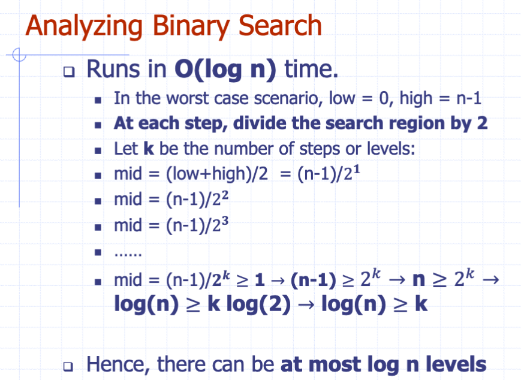
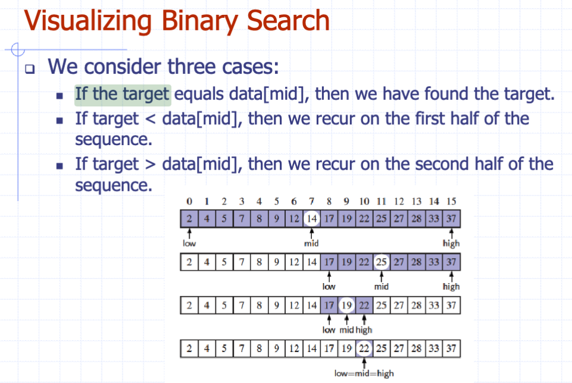

# Recursion

# Exercise 3

**If your first name starts with a letter from A-J inclusively:**

An array A contains n−1 unique integers in the range \[0,n−1\], that is,
there is one number from this range that is not in A. Design an
O(n)-time algorithm for finding that number. You are only allowed to use
O(1) additional space besides the array A itself. Write the java method
that implements this algorithm and a main method to test it.

**Hint:** Numbers in $0, n-1$ form an arithmetic progression whose sum
is known.

We can leverage the fact that the sum of the first $n$ natural numbers is given by the formula $\frac{n(n-1)}{2}$ and then subtracting the sum of the elements in the array, we can find the missing number.

**If your first name starts with a letter from K-Z inclusively:**

Given an array A of n arbitrary integers, design an O(n)-time algorithm
for finding an integer that cannot be formed as the sum of two integers
in A. Write the java method that implements this algorithm and a main
method to test it.

**Hint** The sum of every two integers in A is always less or equal to
twice the maximum element.

- **Step 1**: Find the maximum element in the array.
- **Step 2**: Create a boolean array `sumExists` of size $2 \times \text{maxA} + 1$.
- **Step 3**: Iterate through each pair of elements in the array and mark the possible sums in the`sumExists` array.
- **Step 4**: Find and return the smallest index in the `sumExists` array that is still `false`.
